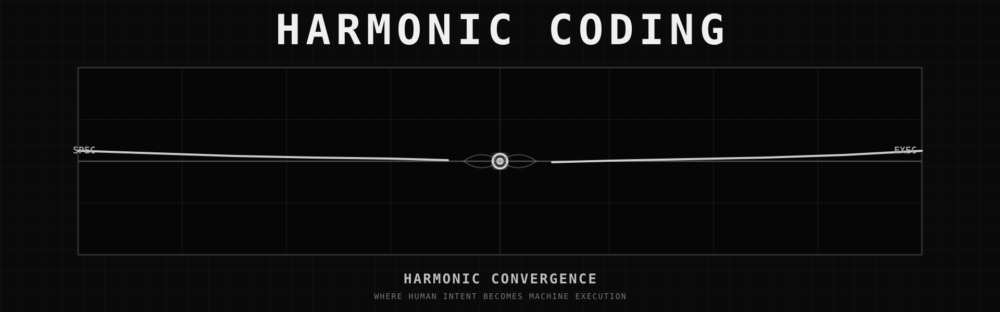

# Harmonic Coding

A comprehensive framework for human-directed AI coding combining spec-driven development, Copilot best practices, and AI-driven design patterns (AIDD).

## Philosophy

Harmonic Coding treats the synthesis of human intention and machine execution as a unified resonance. Specifications become the score; AI becomes the instrument. The result is elegant, efficient code where human direction and machine capability align in perfect harmony.

## Core Principles

- **Specification-First**: Clear, executable specifications drive all code generation
- **Iterative Synthesis**: Human feedback refines AI output through cycles of addition and refinement
- **Harmonic Alignment**: Human intent and AI execution resonate as a single system
- **Minimal Friction**: Elegant tooling, elegant processes, elegant results

## Contents

- Methodology documentation
- Best practices for spec-driven AI development
- Copilot integration patterns
- AIDD frameworks and examples
- Case studies and implementations

## Getting Started

[Documentation coming soon]

---

*Where human direction meets machine synthesis.*

## Contributors

- [@albrp97](https://github.com/albrp97)
