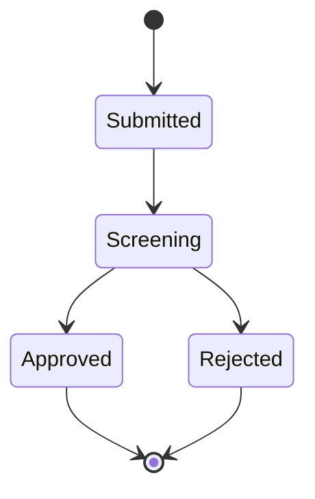
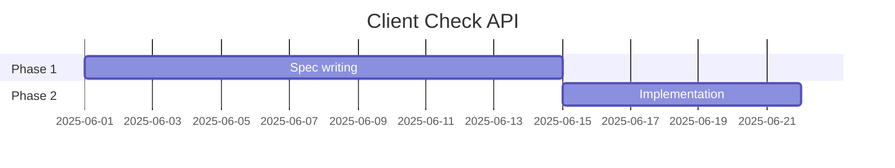
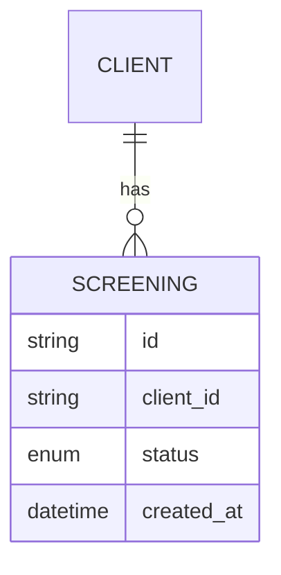

# Spec-Driven Development: The Engineering Discipline

> This is not about using AI to write code faster. It is about shifting the locus of engineering value from code to specification. The code becomes a build artifact. The spec becomes the product.

---

## The Core Claim

A specification written once to sufficient quality can:
1. Generate a working implementation
2. Be adapted for different stacks by prompting (no code edits)
3. Be reused as a factory template for similar systems
4. Serve as documentation, architecture decision record, and test contract simultaneously
5. Regenerate the codebase if the code is lost or needs to be scrapped

This only works if the spec is written to a standard that produces consistent output across model versions and runs. Getting there is the engineering work.

---

## Anatomy of a Production-Grade Spec Sheet

### Required Sections

**1. Problem Statement**
What exists today, what doesn't, what pain it causes, what success looks like. One page max. No jargon. AI reads this to calibrate domain understanding before building.

**2. Scope Boundaries**
Explicit "in scope" and "out of scope" lists. Be brutal. Every ambiguous requirement will be interpreted by the model — if you don't specify it, the model will decide. That decision may be wrong.

**3. Functional Requirements**
Numbered, verb-first statements. Not "the system should handle" — instead: "The API MUST return 400 when field X is missing." Use MUST/SHOULD/MAY RFC-2119 style throughout.

**4. Technical Architecture**
- Tech stack (language, framework, version)
- Directory structure (specify it explicitly — models have preferences you may not share)
- External integrations (APIs, databases, auth systems)
- Data models (describe entities, relationships, constraints)

**5. Integration Contracts**
For each external API: base URL, auth method, endpoints used, request/response schemas, error codes, rate limits. Paste this from official docs (in Markdown form). The model cannot invent what it does not know.

**6. Test Requirements**
Specify where tests live, what test framework, what coverage is expected. List the specific scenarios that must be covered. If you don't specify test cases, you get whatever the model decides to test — usually happy paths.

**7. Non-Functional Requirements**
Performance targets, security constraints, logging standards, error handling patterns. These are nearly always omitted and nearly always the source of production failures.

**8. Coding Standards Header**
Your team's coding standards file, referenced or inlined. This is the single highest-ROI addition — it applies to every generated file without you repeating it.

**9. Known Anti-Patterns / Avoidance Rules**
This section grows over time. Every bug found → "The implementation MUST NOT do X because it causes Y." This is your spec's immune system.

---

## The 50-Prompt Spec Iteration Process

Charles' team wrote approximately 50 prompts to build the client check spec. Not 50 prompts to write code — 50 prompts to write the spec. This is the engineering work.

### Phase 1: Bootstrap (prompts 1-10)
Seed the spec with the problem statement and core requirements. Let the model draft an initial structure. Then read it critically — not for code quality, for coverage.

```
You are helping me write a specification document for [system].
Here is the problem statement: [...]
Here is the external documentation: [paste Markdown]
Draft an initial specification covering: problem statement, scope, 
core functional requirements, and the main integration points.
Output only the specification document.
```

### Phase 2: Expansion (prompts 11-35)
Add depth to each section. One prompt per concern:

```
Update the spec to include: automatic test case generation.
All test cases must go into the /tests directory.
Use the pytest framework.
The following scenarios MUST have dedicated test cases: [list]
```

```
Add to the spec: the security requirements section.
The API must validate all inputs against the following rules: [...]
OWASP Top 10 vulnerabilities must be explicitly addressed.
Rate limiting: 100 requests/minute per client.
```

```
Add to the spec: the error handling specification.
Every external API call must catch and handle: timeout, 4xx, 5xx.
All errors must be logged with correlation IDs.
User-facing errors must never expose internal stack traces.
```

### Phase 3: Stress Testing the Spec (prompts 36-45)
Read the spec end-to-end and probe for gaps:

```
Review the specification. Identify:
1. Ambiguous requirements that could be implemented multiple ways
2. Missing edge cases in the functional requirements
3. Integration scenarios not covered
4. Test scenarios that would catch the most common bugs
List them, then add the missing requirements to the spec.
```

### Phase 4: Hardening (prompts 46-50)
Final polish:

```
Rewrite the specification for maximum consistency.
Requirements must use RFC-2119 language (MUST/SHOULD/MAY).
Remove all ambiguous language.
Every MUST requirement must have a corresponding test requirement.
```

---

## Implementation: How to Actually Run It

### The Execution Loop

Once the spec is complete, implementation is a loop, not a single command:

```
Prompt 1: "Implement the specification in [spec file path]. 
           Build a step-by-step plan first. 
           Implement steps 1 through 6."

[Agent executes, may stop or say "incomplete"]

Prompt 2: "Continue. Complete the remaining implementation steps. 
           Reference the spec for any decisions."

[Repeat until done]
```

The client check API required ~10 such cycles. Each cycle implemented a portion of the 12-step plan the model generated. The model was not given the plan — it was asked to generate one from the spec.

### Context Loading Strategy

Before each implementation session:
1. Open VS Code with the spec file in context
2. Load all external documentation files (Markdown — not PDFs)
3. If continuing a session, show the existing code structure
4. Use `@workspace` or equivalent to give the agent repo visibility

The spec file should be pinned in the agent's context — reference it explicitly: *"Implement according to the specification in `docs/spec.md`."*

### Handling "I didn't complete the work"

Agents will stop mid-implementation, especially on large specs. Normal behavior. Your responses:

```
"Continue implementing. You stopped at [point]. 
Complete the remaining steps per the specification."
```

```
"What is the current status of the implementation vs the spec?
List what is complete and what remains."
```

Never accept partial implementation without accounting for what's missing.

---

## The Spec as Reusable Asset: The Factory Pattern

### How Belgium Reused the Client Check Spec

The Netherlands needed the same client screening API but against a different blacklist (FRIS vs ERSR). The spec had the integration contract with ERSR explicitly defined.

One prompt:
```
This specification is for the Belgian client check service using ERSR.
I need a Dutch version using FRIS instead.
Adapt the specification: replace all ERSR references and contracts 
with FRIS equivalents. Keep everything else identical.
```

**Output**: New country spec. Same architecture, same test framework, same coding standards, new integration layer. No manual editing.

### The Component Spec Pattern

Large spec sheets (5000+ lines) can be factored into reusable components:

```
docs/specs/
  shared/
    header.md        # UI header component spec
    auth.md          # Authentication requirements
    logging.md       # Logging standards
    security.md      # Security non-functionals
  projects/
    client-check/
      spec.md        # Includes: shared/*, project-specific requirements
      external-docs/ # Moody's, ERSR docs in Markdown
```

When building a new project: `include_specs: [shared/auth.md, shared/security.md]` + project-specific requirements.

### Distributing Specs as Products

The OpenAI Symphony model: release a tool as a specification, not a binary. This creates a different kind of open source:

- Anyone can run it in their preferred language/framework
- It adapts to local tech stacks without forking
- No maintenance of platform-specific builds
- The spec is the documentation

For teams: internal tools can be distributed as spec files. New team member → runs spec → has the tool. Migration to new stack → adapt spec → run it.

---

## Spec Maintenance: The Discipline No One Talks About

### The Bug-Back-to-Spec Rule

Every production bug must produce a corresponding spec update:

```
# Anti-Patterns Section (add to spec)

## Bug-001: Null client ID causes 500
The implementation MUST validate that client_id is non-null and non-empty
before any database query. Return 400 with body: {"error": "client_id_required"}
```

If you fix the code without updating the spec: the next regeneration reproduces the bug.

### Version Control the Spec

The spec is code. Treat it identically:
- Every iteration is a commit with a message
- Branches for major rewrites
- Tags at implementation milestones ("v1.0-spec-frozen")
- PRs for spec changes that affect behavior

### When to Re-run Implementation from Spec

Trigger points:
- Major framework upgrade (changing the stack)
- Accumulated code debt makes the codebase untrustworthy
- New model with significantly better capabilities is available
- Feature addition that the spec already covers but wasn't implemented

The decision to "throw it away and start over" is rational when:
- Spec is at sufficient quality
- Code has poor test coverage and high complexity
- Model capabilities have improved since last run

---

## Mermaid Diagrams as Spec Infrastructure

### Why Text Diagrams Matter

AI cannot reliably interpret Visio/PowerPoint diagrams. Mermaid is:
- Rendered natively in GitHub, DevOps, VS Code
- Generated by any LLM (just ask)
- Fed back into prompts as-is (it's text)
- Version-controlled without conflicts

### Practical Uses in Spec Work

**State machines for process flows:**


Feed this to the agent as the spec for the state machine. The agent knows exactly which transitions to code. No ambiguity.

**Gantt charts for planning (prompt-updatable):**


When the project slips: *"Delay everything by two weeks."* One prompt, all dates move.

**ER diagrams for data models:**


This goes directly into the spec. The agent generates models that match exactly.

---

## Consistency: Making the Spec Produce the Same Output

### What Reduces Output Variance

1. **RFC-2119 language** — MUST removes interpretation. "Should" invites creativity.
2. **Explicit directory structure** — specify it or get whatever the model prefers
3. **Example code snippets** — showing the pattern once locks the style throughout
4. **Anti-pattern section** — explicit "do not" is more reliable than "prefer"
5. **Test requirements before implementation requirements** — forces TDD-consistent behavior
6. **Numbered requirements** — easy to reference in implementation prompts ("implement requirement 23")

### What Introduces Variance

- Vague scope ("handle errors appropriately")
- Missing integration contracts (model invents the API shape)
- No directory/structure specification
- No coding standards reference
- Implicit security assumptions (model assumes defaults)

### The 95% Rule

Charles: *"100% identical output? No. 95% of the job consistent? Yes."*

The remaining 5% variance is typically:
- Variable naming choices
- Comment style
- Helper function organization
- Error message text

These are acceptable. The 5% variance in business logic or integration behavior is not. That's what the spec needs to nail.

---

## The Test-Driven Spec

LLMs perform significantly better at TDD than humans because:
- Writing tests is boring for humans, not for LLMs
- Tests make the spec verifiable at every implementation step
- The model can run tests and self-correct (in agent mode)
- Test failures are unambiguous signals the spec was implemented wrong

### Integrating TDD into the Spec

```markdown
## Test Requirements

### Test Framework
pytest, located in /tests directory, mirroring /src structure.

### Test Coverage Requirements
- Unit tests: all public methods
- Integration tests: all external API calls (mocked)
- E2E tests: all user-facing endpoints

### Required Test Scenarios
TC-001: POST /clients with valid data returns 201 and client_id
TC-002: POST /clients with missing client_id returns 400
TC-003: GET /clients/{id}/screening with active blacklist hit returns 200 with status=BLOCKED
TC-004: External API timeout returns 503 with retry-after header
[...]
```

The agent generates test code from these scenarios. You verify the test cases cover what you specified. You don't need to read the implementation code to validate behavior.

---

## Context Engineering: Maximizing Model Output Quality

### `.github/copilot-instructions.md`

This file is loaded automatically into every GitHub Copilot conversation in VS Code. Use it:

```markdown
# Copilot Instructions

## Stack
- Language: Python 3.11
- Framework: FastAPI
- Database: PostgreSQL with SQLAlchemy
- Testing: pytest with httpx for API tests

## Standards
- Type hints on all functions
- Docstrings on public methods (Google style)
- No bare except clauses
- All datetime values must be UTC

## Anti-Patterns
- Do not use print() for logging; use the structlog library
- Do not mutate function parameters
- Do not use os.environ directly; use the config module
```

### Agent Mode Files

For complex implementation sessions, create a session context file:

```markdown
# Implementation Context

## What we're building
[Reference to spec file]

## Current status
[What's implemented, what's not]

## This session's goal
[Specific section of spec to implement]

## Constraints
[Any decisions already made that the agent must respect]
```

Feed this at the start of each agent session. Prevents the model from re-inventing already-decided things.

### MCP Servers for Copilot

Model Context Protocol servers extend what the agent can do. High-value additions for spec-driven work:
- **GitHub MCP**: PR review, issue creation, branch management directly from agent
- **Database MCP**: agent queries schema directly instead of relying on your description
- **Documentation MCP**: agent reads API documentation sites without manual copy-paste
- **File system MCP**: agent traverses repo structure without being told

---

## The Engineering Role in the Spec-Driven World

The code you write is prompts and specifications. This is not a downgrade — it's a change in leverage.

What requires human engineering judgment:
- Problem decomposition and scope decisions
- Integration contract validation (checking the spec against real API behavior)
- Non-functional requirements (performance, security, resilience) — these must be specified, not discovered
- Test scenario design — the spec must enumerate what matters
- Architecture decisions — the model will implement what you specify, not what you should specify
- Spec quality review — reading a 5000-line spec critically requires domain expertise

What the model handles:
- Boilerplate
- Code structure and organization
- Implementation of specified behavior
- Test code generation
- Documentation generation from code

> *"Our effort is going into specifications. Explaining very well how it is supposed to work, how it should work, how it must behave. We're not looking at factory problems."* — Charles

The engineering skill is specification quality. The best practitioners will be those who can write specs that produce consistent, correct, secure output — and who know when to use 7 lines vs 5000.
